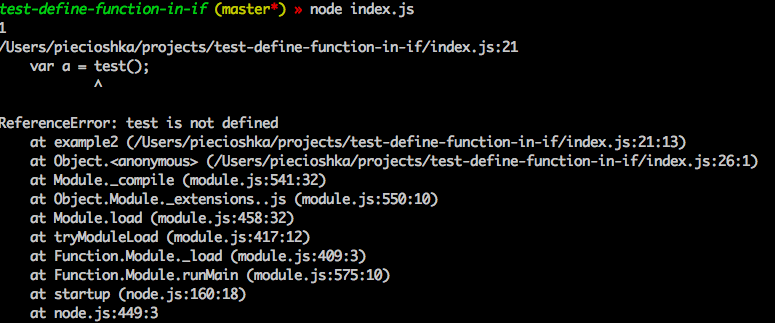

# test-define-function-in-if

> :ledger: What happen if I define function in `if` statement?

## Screenshot



## Code

```javascript
function example1() {
    if (true) {
        function test() { return 1; }
    } else {
        function test() { return 0; }
    }

    var a = test();
    console.log(a);
}

function example2() {
    'use strict';

    if (true) {
        function test() { return 1; }
    } else {
        function test() { return 0; }
    }

    var a = test();
    console.log(a);
}

example1();
example2();
```

## Conclusions

In normal mode I cna do this. But this is bad pattern - please do not repeat it!

In *strict mode* this situation do not define in scope any function.

## License

[The MIT License](http://piecioshka.mit-license.org) 2016 @ Piotr Kowalski
